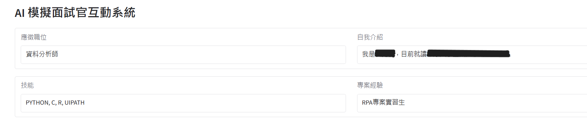
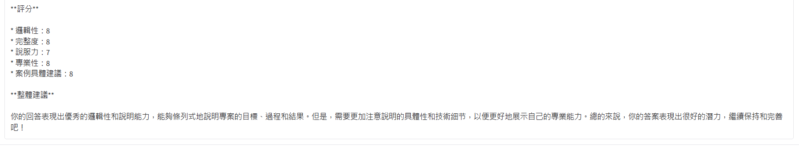

# AI Interview Coach
A prototype system that simulates an **AI interview coach** using **Groq API (LLaMA3-70B)** and **Gradio**.

It generates interview questions based on user background and provides instant feedback with scoring and improvement suggestions.

## Features
- Collect user background: position, introduction, skills, project experience
- Generate job-specific interview questions
- Provide structured feedback on answers:
  - Logic
  - Completeness
  - Persuasiveness
  - Professionalism
  - Use of examples
- Score each answer (0–10) and suggest improvements
- Interactive chatbot interface built with Gradio

## Demo
1. Enter personal information

2. AI generates interview questions

3. Answer the interview questions

4. AI provides feedback on your answers 

5. AI gives scoring and overall suggestions

6. Ask for the next question → AI generates new interview questions

## How to Run
1. Open "AI_Interview_Coach.ipynb" in Google Colab
2. Enter your Groq API Key 
3. Run all cells in order  
4. Launch the Gradio app and start practicing interviews

